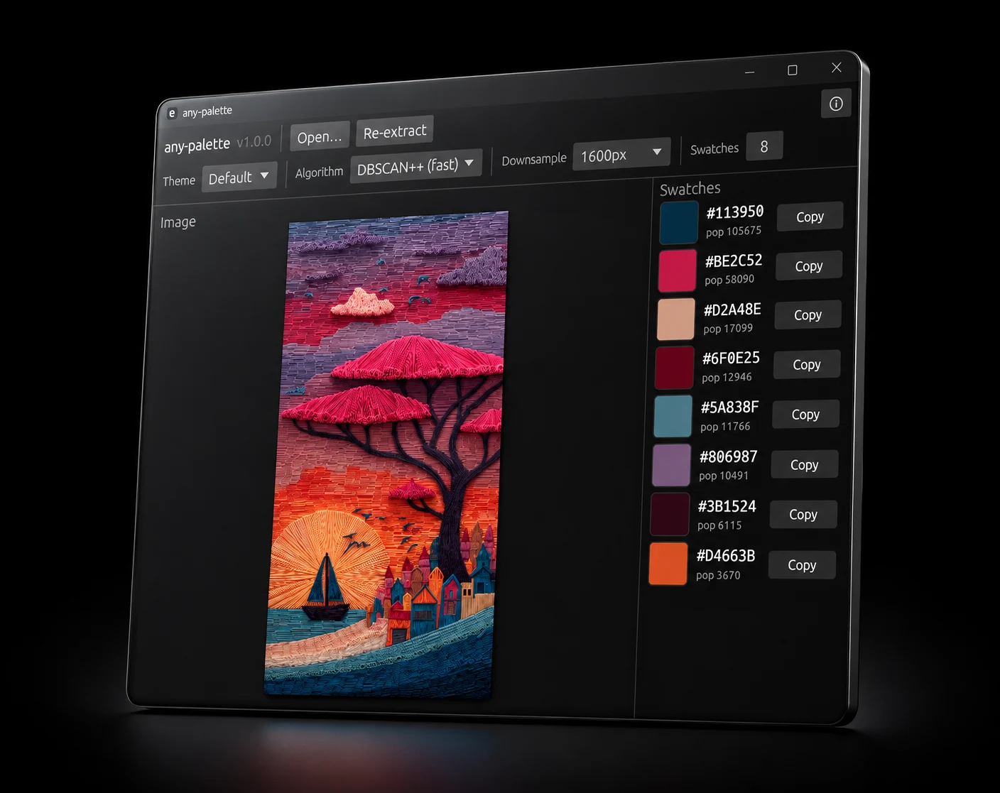

# any-palette



A small desktop app that extracts color swatches from an image. Open or drag-drop a picture, tweak the algorithm and theme, hit **Extract**, and copy each swatch as `#RRGGBB`.

Built with [egui](https://github.com/emilk/egui) / eframe and the [`auto-palette`](https://crates.io/crates/auto-palette) crate.

## Features

- Drag & drop or file-picker image loading (PNG, JPG, BMP, GIF, WEBP).
- Three clustering algorithms: **DBSCAN++** (fast, default), **DBSCAN** (accurate), **K-Means** (fastest).
- Six palette themes: Default, Colorful, Vivid, Muted, Light, Dark.
- Adjustable downsampling (1024 / 1600 / 2048px / Off) — image size is the main driver of extraction time.
- Configurable swatch count (1–32).
- One-click copy of each color as hex.
- Background extraction thread keeps the UI responsive.

## Running

```bash
cargo run --release
```

`--release` is strongly recommended; palette extraction is CPU-heavy and the debug build can be 10× slower.

## Tips

- If extraction feels slow, keep **Downsample** at 1600px or lower and use **DBSCAN++**.
- Use **DBSCAN** when you need the most faithful palette and don't mind the wait.
- **K-Means** is the fastest but less faithful to the image's actual color distribution.

## License

MIT
