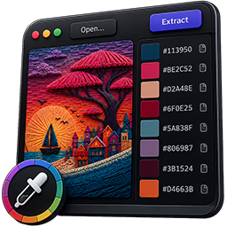
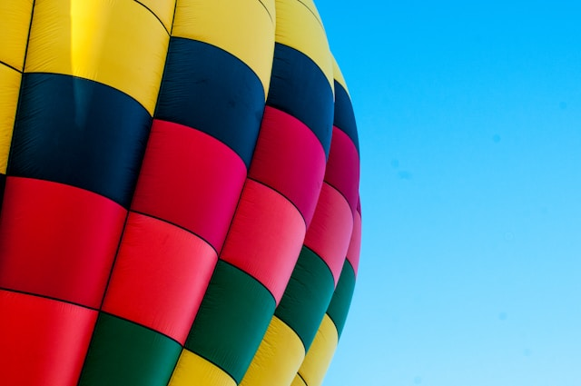

<div align="center">
  
  <h1>any-palette</h1>
  <p align="center">
    <strong>Built on top of <a href="https://github.com/t28hub/auto-palette">auto-palette</a> for the color extraction and <a href="https://github.com/emilk/egui">egui</a> for the UI.</strong><br />
    A small desktop app that extracts color swatches from an image. Open or drag-drop a picture, tweak the algorithm and theme, hit <b>Extract</b>, and copy each swatch as <code>#RRGGBB</code>.
  </p>
</div>

## Example



| Theme       | Color Palette                          |
|-------------|----------------------------------------|
| `(Default)` |    |
| `Colorful`  |  |
| `Vivid`     |        |
| `Muted`     |        |
| `Light`     |        |
| `Dark`      |          |

> [!NOTE]
> Photo by <a href="https://unsplash.com/@laurahclugston?utm_content=creditCopyText&utm_medium=referral&utm_source=unsplash">Laura Clugston</a> on <a href="https://unsplash.com/photos/multi-colored-hot-air-balloon-pwW2iV9TZao?utm_content=creditCopyText&utm_medium=referral&utm_source=unsplash">Unsplash</a>

## Features

- Drag & drop or file-picker image loading (PNG, JPG, BMP, GIF, WEBP).
- Three clustering algorithms: **DBSCAN++** (fast, default), **DBSCAN** (accurate), **K-Means** (fastest).
- Six palette themes: Default, Colorful, Vivid, Muted, Light, Dark.
- Adjustable downsampling (1024 / 1600 / 2048px / Off) — image size is the main driver of extraction time.
- Configurable swatch count (1–32).
- One-click copy of each color as hex.
- Background extraction thread keeps the UI responsive.

## Running

```bash
cargo run --release
```

`--release` is strongly recommended; palette extraction is CPU-heavy and the debug build can be 10× slower.

## Tips

- If extraction feels slow, keep **Downsample** at 1600px or lower and use **DBSCAN++**.
- Use **DBSCAN** when you need the most faithful palette and don't mind the wait.
- **K-Means** is the fastest but less faithful to the image's actual color distribution.

---

_Wait for more..._

Support me on PayPal

[](https://paypal.me/mohammadmoustafa1)
